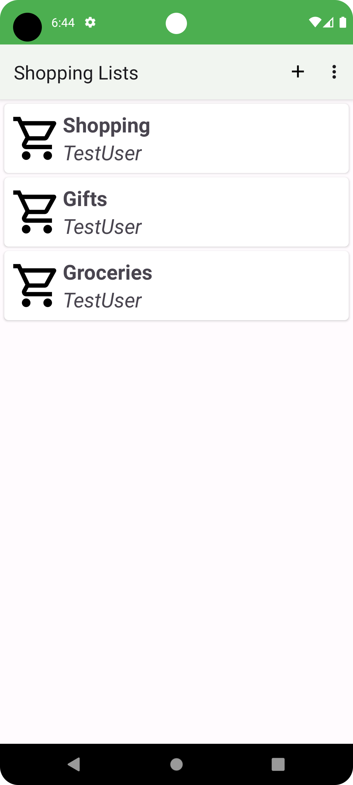
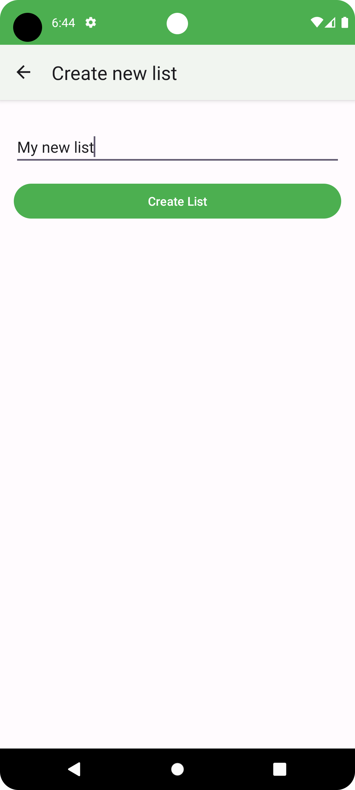
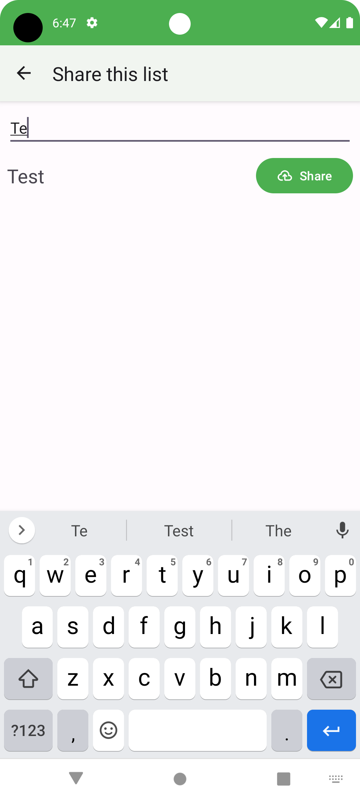
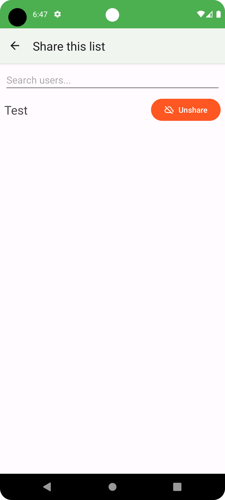
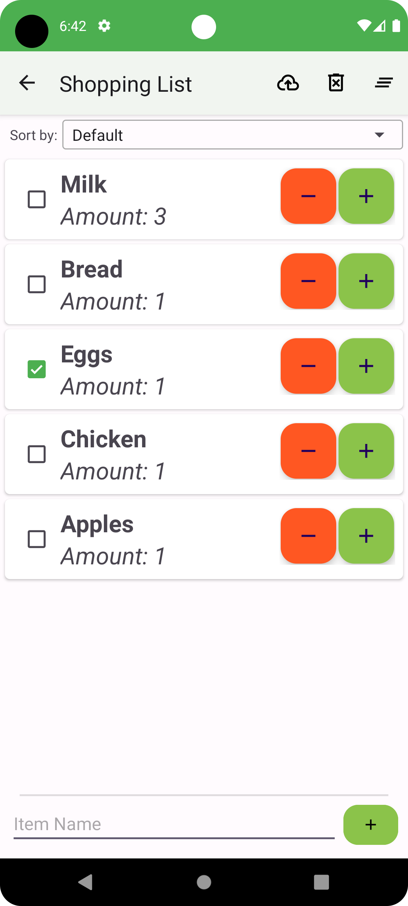
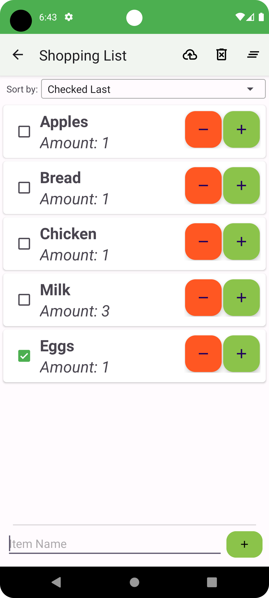

# The shared shopping list app
This small app allows you to create and share you shopping list with friends and familiy.

## Create new lists
It allows you to create new lists only for yourself to keep track of all the things you want to buy.

    
    

## Share your lists
If you want someone else to be able to look at your list and add or remove something, you can share the list by searching for the username and tap on 'Share'.

Of course, the list can also be unshared again.

## Organize list
Finally, the list can be ordered to move bought items back in the list (and more)

    
    

Have fun!